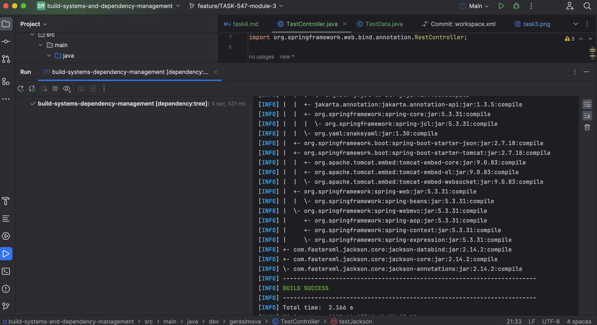
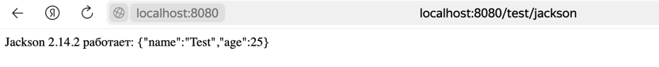

1. С помощью тега  <exclusions> </exclusions> исключила транзитивные зависимости в библиотеке 
<artifactId>spring-boot-starter-web</artifactId>
<version>2.7.18</version>,
которая подтягивала библиотеку Jackson версии 2.13.5.

2. Далее в pom файле добавила зависимости библиотеки Jackson версии 2.14.2.

3. Команда mvn dependency:tree выводит все подключенные зависимости. По выводу видно, что библиотека
Jackson версии 2.13.5 отсутствует в списке, но есть Jackson версии 2.14.2, что говорит о том, что 
мы удачно исключили ненужные нам зависимости. 

Для теста я вывела версию библиотеки Jackson.

