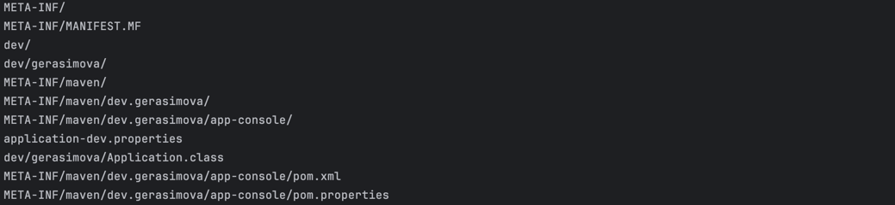
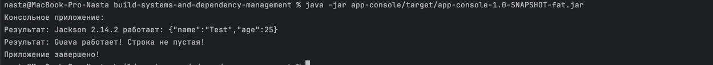

## Результаты работы плагина:

Внутри папки target в модуле app-console теперь содержится 2 файла jar: обычный и fat-jar.

### Файл app-console/target/app-console-1.0-SNAPSHOT.jar

Внутри него содержатся файлы папки META-INF, (по умолчанию) application-dev.properties, классы модуля, ресурсы модуля.

jar tf app-console/target/app-console-1.0-SNAPSHOT.jar - данная команда позволяет посмотреть на содержимое этого файла.

#### Вывод:

В этом файле нет зависимостей, только манифест, файлы классов и application.properties в зависимости от профиля.

### Файл app-console/target/app-console-1.0-SNAPSHOT-fat.jar

Данный jar уже включает в себя все зависимости проекта, выполнив команду

jar tf app-console/target/app-console-1.0-SNAPSHOT-fat.jar, 

мы увидим те же файлы, что и в предыдущем случае, но к ним прибавятся зависимости из 
модуля core-lib, зависимости google и jackson. 

### Плагин упрощает запуск приложения:

java -jar app-console/target/app-console-1.0-SNAPSHOT-fat.jar 

